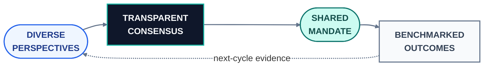
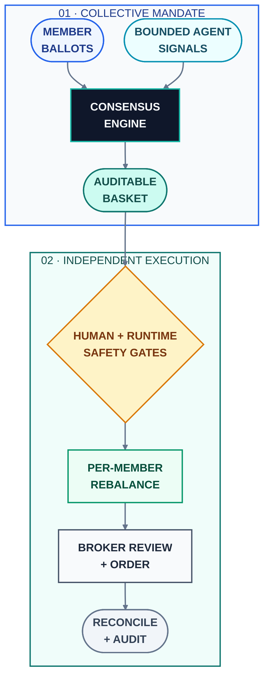

# Concordia — vote-governed portfolio execution

This README is the public technical overview and navigation guide for
Concordia. It explains the club's vote-governed investment model, independent
member-account execution, trading cycle, safety boundaries, technology stack,
and operating status, then directs readers to the detailed safety,
architecture, and design documents in this repository.

**Live demonstration: [demo.voteconcordia.com](https://demo.voteconcordia.com) — invite code `demo`**

Concordia is a production-deployed, real-money investment club in which
portfolio construction is governed by member vote. During each trading cycle,
participants allocate 100% of their voting power across an S&P 500 universe.
The highest-conviction selections form a consensus basket, which Concordia
automatically rebalances inside each participant's independently owned
Robinhood account. Capital is never pooled, the club never assumes custody, and
the platform has no mechanism to deposit, withdraw, or transfer member funds.

> **Collective judgment, accountable influence, independent custody.**

## Goal

Concordia's goal is to test whether a diverse group can produce a more robust
portfolio decision than any single participant while keeping every judgment
measurable and every account independently controlled. It turns social
investment discussion into a repeatable operating loop: express conviction,
aggregate it transparently, execute one shared mandate, measure each call
against a benchmark, and feed the evidence into the next cycle.

The project does not assume that a majority is automatically correct or that
past performance guarantees future judgment. It is designed to make the
collective process inspectable: who expressed conviction, how influence was
calculated, what the group selected, what each account executed, and how those
decisions compared with the S&P 500.

## Why collective intelligence

The governing idea is not to follow conventional wisdom blindly. It is to make
the **wisdom of crowds** more disciplined by combining four conditions:

- **Diverse perspectives.** Members and bounded research agents may bring
  different time horizons, sectors, and analytical styles to the same ballot.
- **Independent judgment.** Every participant allocates a complete ballot
  before the group result becomes the execution mandate.
- **Transparent aggregation.** Conviction is summed through one documented
  tally rather than selected by an opaque portfolio manager.
- **Measurable feedback.** Voting power blends committed capital with an EWMA
  of historical accuracy, with performance influence phased in as evidence
  accumulates instead of overreacting to one successful call.

The club has operated with real capital since July 2026. Private members
participate through their own accounts alongside research agents whose signals
may contribute to the tally within configured limits. Those agents possess no
broker credentials and cannot authorize execution; real orders still require
human participation, live-mode configuration, and explicit runtime arming.
The public demonstration runs the same application against an isolated,
deterministic brokerage simulator: onboarding, voting, research, basket
formation, performance history, and account reporting are fully functional,
while every order remains simulated. Public demonstration registrations are
open.

## System at a glance

The platform coordinates one shared portfolio decision while preserving
independent account ownership, credentials, balances, broker review, and order
records for every member. The public demonstration shares product behavior,
not production authority or member data.

## What this repository demonstrates

| Engineering area | Public evidence |
|---|---|
| **Financial-system safety** | Independent execution gates, deterministic order identity, broker-side vetoes, stale-session refusal, and reconciliation against broker truth. |
| **Security and privacy architecture** | Encrypted per-member OAuth tokens, isolated application instances, member-scoped account access, and a deny-listed one-way public-data mirror. |
| **Workflow orchestration** | Auditable systemd timers coordinate voting, tallying, settlement-aware sells and buys, account snapshots, reporting, and backups. |
| **Full-stack product engineering** | One typed application supports member, administration, and public-demo experiences with origin-isolated sessions and role-specific shells. |
| **Data integrity** | Recorded and estimated observations remain distinguishable, presentation state is derived rather than destructive, and charts cannot render prices outside observed ranges. |

## Trading cycle

1. **Allocate.** Members distribute voting power across the securities they
   want the club to hold. Voting power blends committed capital with measured
   historical accuracy, whose influence phases in as evidence accumulates.
2. **Form consensus.** At the close of the ballot, Concordia aggregates the votes into an approximately 20-security, conviction-weighted basket.
3. **Rebalance.** The executor independently aligns each participating account with the consensus mandate. Securities leaving the basket are sold, new constituents are purchased, overweight positions are trimmed, and correctly weighted holdovers remain untouched. Sell and buy legs run on consecutive trading days to respect T+1 settlement in cash accounts; the system does not use margin.
4. **Measure.** Club-wide and member-level decisions are evaluated against an
   S&P 500 buy-and-hold benchmark, and the resulting accuracy evidence informs
   the next voting-power snapshot before the process repeats.

## Technical documentation

- **[Engineering case study](docs/ENGINEERING.md)** — Provides an employer-oriented account of the system's scope, trust boundaries, hardest implementation problems, and verification strategy without exposing private source or member data.
- **[Safety](docs/SAFETY.md)** — Defines the independent conditions required before the system may place a real order, together with the stale-session guard introduced after a near miss could have repurchased a basket the club had exited six cycles earlier.
- **[Architecture](docs/ARCHITECTURE.md)** — Describes two isolated instances of one codebase on a single server and the one-way file boundary that exposes the live club's aggregate track record to the public demonstration without granting access to production credentials or member data.
- **[Design](docs/DESIGN.md)** — Records the product and data-integrity decisions behind the system, including the removal of Catmull–Rom chart smoothing after measured renderings exceeded the true price range in 13 of 15 symbol-and-window combinations.

These documents include focused excerpts from the private production repository. The complete source remains private because the platform executes real orders through connected member accounts.

## Technology

FastAPI; SQLite in WAL mode; Next.js 14; systemd services and timers on a
single Linux server; per-member Robinhood OAuth through MCP; and more than 200
backend test functions across governance, execution, authentication, market
data, reconciliation, and public-demo boundaries.

## Operating status

Production membership remains invitation-only. The public demonstration is persistent, and demonstration accounts retain their voting and performance history between visits.

Contact: rohannj29@gmail.com

Code excerpts in `docs/` are published for technical review; all rights reserved.
