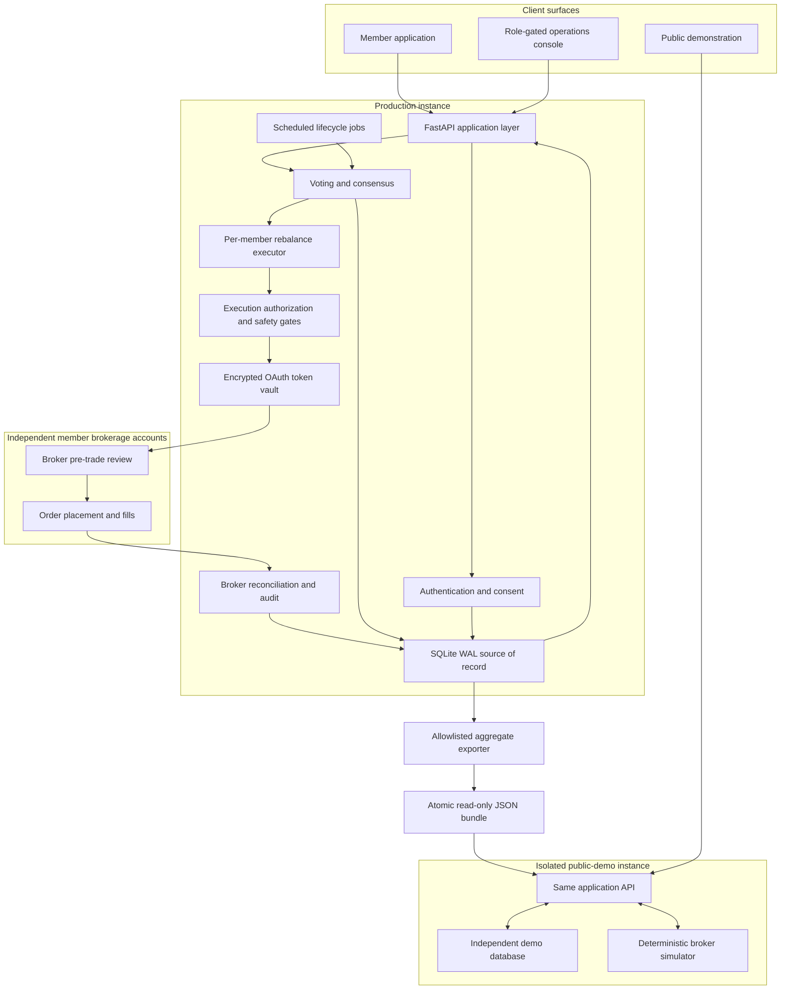

# Architecture — auditable execution on a consolidated runtime

This architecture document describes how Concordia's backend, frontend,
brokerage integration, scheduled execution, and public demonstration operate
as two isolated instances of one codebase on a single Linux server. It defines
the runtime components, credential boundaries, one-way production-data mirror,
per-member execution path, and separation between display caching and live
order sizing. The design prioritizes an execution path that one operator can
inspect, reconcile, and recover over distributed infrastructure that the
club's workload does not require.

## Production and demonstration topology



The most important boundary is not between frontend and backend; it is between
governance, authorization, and custody. Consensus determines a portfolio
mandate, but only the execution layer can translate that mandate into
member-specific orders, and it can do so only after evaluating independent
safety gates and broker review. Credentials remain member-scoped throughout.

## Runtime components

**Backend.** FastAPI runs over SQLite in WAL mode under a dedicated Unix
service account. That account exclusively owns the database, encrypted broker
token vault, and environment configuration. Cycle operations — ballot opening,
closing and tallying, sell and buy execution, ten-minute account snapshots,
public-record mirroring, and database backup — are implemented as small
`jobs/*.py` entry points. Fourteen independent systemd timers schedule these
jobs, making each operation directly inspectable through `systemctl status`
and independently restartable.

**Frontend.** A single Next.js 14 artifact serves the member application,
administration console, and public demonstration. Hostname-based routing
selects the appropriate application shell:

```ts
// web/lib/host.ts
/** demo.voteconcordia.com — the public fake-money instance. */
export function isDemoHost(): boolean {
  if (typeof window === "undefined") return false;
  return window.location.hostname.startsWith("demo.");
}
```

An equivalent `isAdminHost` predicate selects the operations console for the
`admin.` hostname.

**Brokerage.** Concordia integrates with Robinhood's Agentic Trading MCP. Each
member authorizes an independently owned account through OAuth during
onboarding. Tokens are stored in the encrypted vault and decrypted only on the
server. Credentials are never shared with the club or other participants, and
the club maintains no pooled brokerage account. Every order is authenticated
with the individual member's token, placed in that member's account, and sized
against that member's explicit capital commitment.

## Two instances, one codebase

The live club and public demonstration execute the same application code. The
demonstration runs the production executor, voting engine, and onboarding
workflow rather than a mock interface. Under `DEMO_MODE`, however, the token
vault returns a `DemoClient` instead of a Robinhood client. Market data is
deterministic, every simulated pre-trade review succeeds, and no external
brokerage request is made. The runtime also forces `is_live` to false whenever
demonstration mode is active, preventing a configuration error from enabling
real order placement.

Each instance maintains an independent database, session keys, and systemd
units. They share physical infrastructure and a source checkout, but no
runtime state or credentials.

## One-way production data boundary

An isolated demonstration database contains no production trading history.
Generating fixtures would fabricate a track record, while leaving the pages
empty would prevent evaluation of the real reporting experience. Concordia
therefore exposes only the club's aggregate production record through a
constrained one-way transfer.

A direct read-only connection from the public application to the production
database was rejected because a public sign-up surface should never have a
code path to member records or encrypted broker tokens. Instead, a
production-side job periodically writes a single JSON document containing
approved club-level payloads, which the demonstration reads. The public
process holds neither credentials nor a network path to the production
database. Complete compromise of the demonstration would therefore expose no
more than the aggregate JSON already intended for public display.

The mirror job also validates the payload before publication. Club-history
responses are byte-identical across members, an invariant enforced by test,
and a deny-list rejects the entire export if any member-scoped key appears:

```python
# backend/jobs/mirror_club.py
_FORBIDDEN = {"email", "display_name", "member_id", "members", "name", "votes_by",
              "holdings", "account_number", "token", "password_hash"}

def _assert_clean(rows: list[dict]) -> None:
    for row in rows:
        bad = _FORBIDDEN.intersection(row.keys())
        if bad:
            raise SystemExit(f"refusing to mirror: club history row carries member-scoped keys {sorted(bad)}")

def build(limit: int = 60) -> dict:
    if settings.demo_mode:
        raise SystemExit("refusing to run on a demo instance — this mirrors FROM the real club")
    history = voting.club_history(limit)
    _assert_clean(history)
    # ...
```

Publication uses atomic `os.replace`, preventing the demonstration from
reading a partially written file. If the mirror is absent or malformed, the
public reader falls back to its local empty-club state rather than exposing an
error or attempting access to production.

## Execution model

Execution proceeds independently for each member. The service reads current
balance and club-attributed holdings, computes the required changes against
the consensus basket, and submits every proposed order to broker-side
pre-trade review. Constituents leaving the basket are sold, overweight
positions are reduced, entrants and underweights are funded, and correctly
weighted holdovers generate no order. Final placement authority is represented
by a single boolean established at the start of the run:

```python
# backend/app/services/executor.py
armed = is_armed()
will_place = settings.is_live and armed and not force_dry_run
# Human-quorum floor: never spend real money on a basket chosen
# without human participation.
if will_place and voting.human_voter_count(session["id"]) < settings.min_human_voters:
    will_place, quorum_blocked = False, True
# ...
if will_place and not calendar_covers(_today_et()):
    will_place, calendar_stale = False, True
base = "LIVE" if will_place else ("DRY_RUN(disarmed)" if settings.is_live else "DRY_RUN")
```

When `will_place=False`, all downstream sizing, validation, review, and record
generation still occurs, but no order reaches placement. A disarmed run
therefore produces the same review artifact available for inspection before
authorization. The complete control model, including stale-basket rejection
and consequence-based failure behavior, is documented in
[SAFETY.md](SAFETY.md).

## Display caching is isolated from order sizing

The account page originally performed five live broker round trips per visit,
producing approximately four seconds of latency. A snapshot layer now reads
each member account once per ten-minute interval and serves the interface from
a local stale-while-revalidate record. This cache is restricted to display
paths: order sizing is prohibited from reading it and always performs a fresh,
uncached broker query. The member interface may therefore be up to ten minutes
behind the broker, while every trading decision uses current account state.

## Public disclosure boundary

This public architecture exposes the system properties required for technical
evaluation: non-custodial account separation, scheduled lifecycle management,
execution authorization, deterministic retry behavior, broker reconciliation,
display/trading data separation, and public-demo isolation. It intentionally
omits private schemas, route inventories, token formats, member records,
credentials, internal hostnames, mutable administration contracts, and
deployment or recovery commands. The one-way mirror contains only aggregate
club information already intended for public display.
