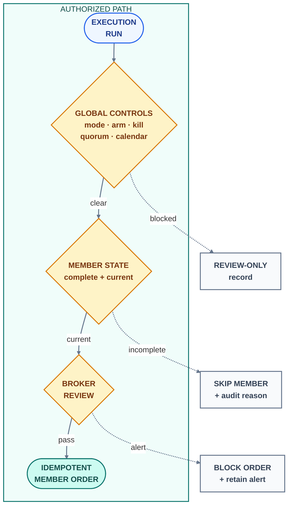

# Engineering case study — Concordia

This engineering case study explains what Concordia demonstrates as a
production financial-software project, which trust boundaries drive its
architecture, and what evidence an employer can evaluate in this public
repository. It is derived from the private production implementation while
excluding source code, member data, credentials, internal APIs, and operational
instructions that could expose the live club.

## Project scope

Concordia coordinates a vote-governed portfolio across independently owned
brokerage accounts without pooling capital or taking custody. The private
application includes a FastAPI backend, a Next.js member and administration
experience, SQLite in WAL mode, encrypted per-member OAuth storage, scheduled
trading-cycle jobs, a broker simulator, production monitoring and backup jobs,
and more than 200 backend test functions.

The core engineering challenge is translating one collective decision into
many account-specific rebalances while preserving each member's authorization,
capital limit, brokerage state, and audit history.

## Order-authorization decision map

The executor performs the same sizing, validation, and pre-trade review work in
dry-run or disarmed states, producing an inspectable artifact without touching
capital. Uncertainty narrows authority: a failed global gate produces
review-only output, incomplete member data skips that member, and a broker
alert blocks only the affected order.

## Hard problems and decisions

| Problem | Engineering decision | Public evidence |
|---|---|---|
| One basket must execute across accounts with different balances and holdings. | Compute a separate rebalance plan per member from current broker state and the member's explicit capital commitment. | Holdovers generate no order, entrants and underweights are funded, and departing or overweight positions are reduced independently. |
| A retry after partial failure must not duplicate orders. | Derive deterministic order identity from the cycle, member, security, and action, then reconcile local state against the broker before execution. | Ambiguous local errors are promoted to filled, rejected, or retryable states using broker records as truth. |
| Cash-account settlement separates sells from buys. | Run the legs on consecutive trading days and reject any session older than the bounded settlement window. | A documented near miss led to the stale-basket guard that blocks obsolete cycles rather than inferring intent. |
| Research agents can inform governance but must not independently trigger capital movement. | Bound agent influence, require human participation, and separate consensus from live-mode and runtime-arming authority. | Agents have no broker credentials; a basket still cannot reach placement unless every execution gate passes. |
| A public demo should prove the product without touching production. | Run the same application against a deterministic broker simulator, an independent database, and a one-way allowlisted aggregate-data mirror. | Complete compromise of the demo would expose only data already approved for public display. |
| Fast account pages and current trading decisions need different freshness guarantees. | Serve display snapshots with stale-while-revalidate behavior while prohibiting order sizing from using cached balances or holdings. | The UI may be minutes behind; execution always performs a fresh broker read. |

## Trust model

Concordia separates five forms of authority:

- **Governance authority** determines the consensus basket but cannot place an
  order.
- **Execution authority** requires live configuration, explicit human arming,
  sufficient human participation, a current market calendar, and no kill state.
- **Broker authority** may reject any proposed trade based on account or market
  conditions and cannot be automatically overridden.
- **Credential authority** remains scoped to the member whose account will
  receive the order; the club maintains no pooled brokerage identity.
- **Presentation authority** may display derived state but cannot overwrite the
  underlying vote, order, review, fill, or error records.

## Verification strategy

- Governance tests cover ballot allocation, reputation and voting-power
  behavior, consensus formation, human participation, and agent-signal limits.
- Execution tests cover deterministic identifiers, dry-run behavior, partial
  feeds, caps, stale sessions, settlement phases, broker alerts, and replay.
- Security tests cover authentication, token encryption and rotation, consent,
  account deletion, and role boundaries.
- Demonstration tests cover simulator behavior, isolated data, public mirror
  allowlists, and atomic publication.
- Market-data and chart tests preserve the distinction between observed and
  estimated values and prohibit visually invented extrema.

## Selected engineering outcomes

- Converted a potentially destructive stale-session condition into a hard,
  audited refusal with dedicated regression coverage.
- Made retries idempotent across both local records and broker-visible order
  identity rather than relying on process memory.
- Preserved member access to voting during broker outages while making
  incomplete financial data fail closed for execution.
- Reduced account-page latency through snapshots without allowing cached state
  into order sizing.
- Replaced smoothed chart interpolation after measurement proved that it drew
  prices outside the true high and low in 13 of 15 tested views.
- Built a persistent public demonstration from the production application
  without granting it production database access or member credentials.

## What an employer can evaluate

The public repository supports technical discussion of fintech architecture,
idempotent workflow design, security and privacy boundaries, reconciliation,
failure semantics, system scheduling, database trade-offs, full-stack product
design, testing strategy, and incident response. The live demonstration shows
the member experience; the documents explain the system decisions and their
measured consequences.

## Intentional omissions

The public version does not publish source code, member or account records,
OAuth material, complete schemas, private API contracts, administration
controls, internal infrastructure details, raw audit events, deployment
procedures, or disaster-recovery commands. Those omissions keep the live club
and its participants protected while leaving the architecture and engineering
reasoning open to review.
